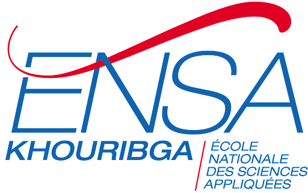

    

        <strong>
            Realise par :
        </strong>  
         &nbsp;&nbsp;&nbsp;&nbsp;Omar Lahbabi 
         &nbsp;&nbsp;&nbsp;&nbsp;Mouad Elrharbi 
    

    

        

            2024-2025
        

        

                
        

    

 

    <strong>
        Filliere :
    </strong>  IID3

    <strong>
        Encadre par : 
    </strong>Pr. Ourdou Amal

 

    Rendu du TP DEVOPS

